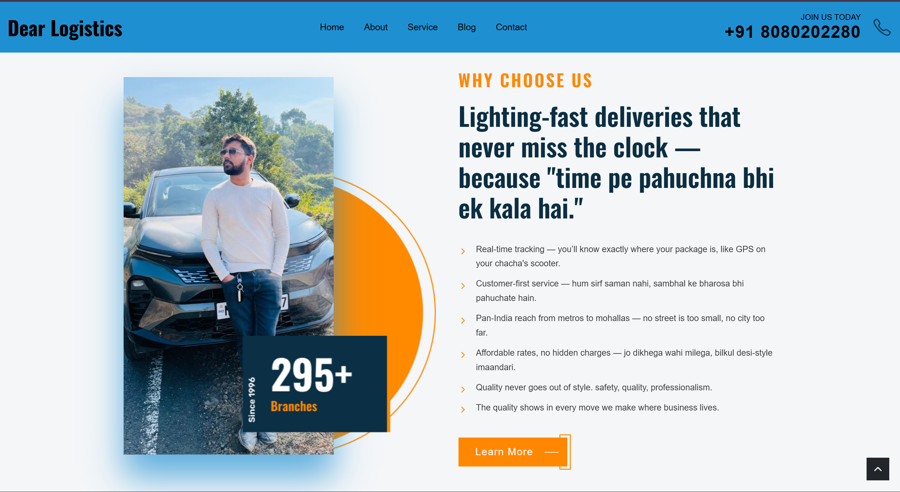
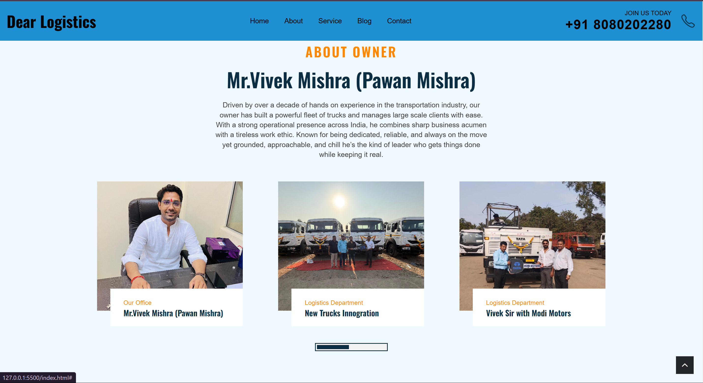
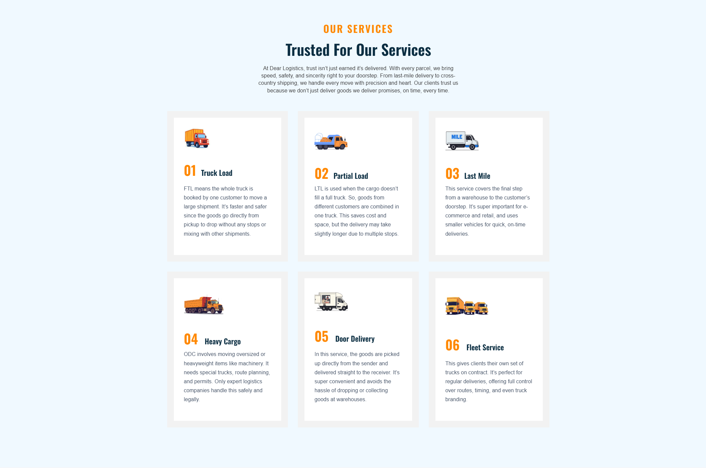
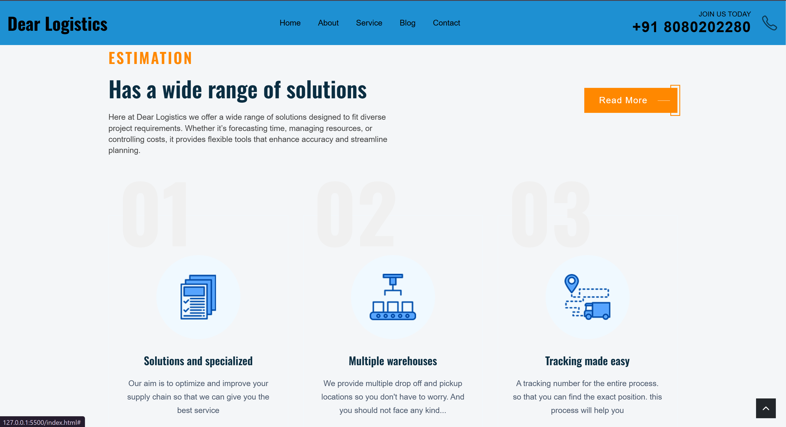
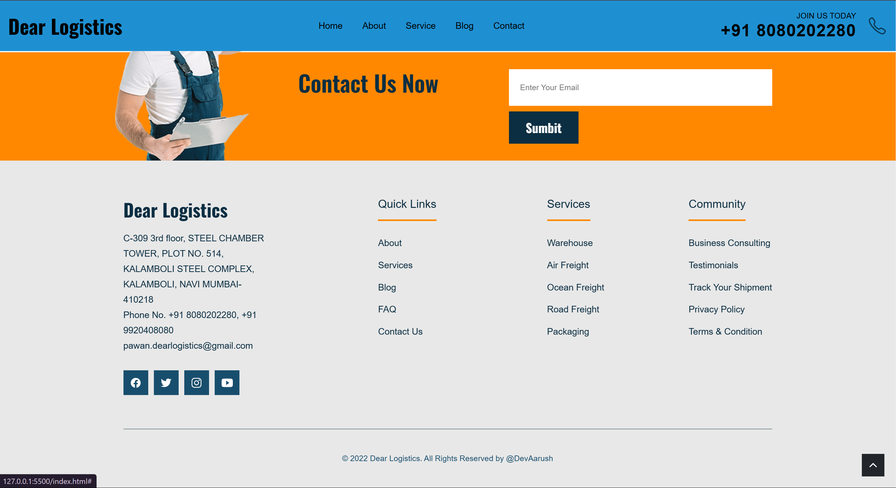

# 🚚 Dear Logistics — Smart & Reliable Logistics Management

**Dear Logistics** is a smart logistics management system designed to simplify transportation and delivery workflows. Built with **Node.js**, **Express**, and **MongoDB**, this project offers a scalable backend for managing shipments, tracking orders, and optimizing routes efficiently.

## 📸 Preview

### 🏠 Homepage

### About Us

### Services

### Estimation

### Join Us

### Footer

## 🚀 Features

- 🚛 Manage shipments, vehicles, and drivers
- 📦 Track orders in real-time
- 🔄 Update delivery statuses dynamically
- 🔐 User authentication and role management
- 📊 Generate reports and analytics dashboards

---

## 🛠️ Tech Stack

- **Backend:** Node.js, Express.js
- **Database:** MongoDB (NoSQL)
- **Authentication:** JWT or Passport.js (if implemented)
- **API:** RESTful endpoints for CRUD operations

---

## 📂 Project Structure

DEAR LOGISTICS/
├── assets/
│ ├── css/
│ │ ├── blog-card.css
│ │ └── style.css
│ ├── images/
│ └── js/
│ └── script.js
├── node_modules/
├── readme-images/
│ ├── desktop.png
│ └── favicon.svg
├── index.html
├── index.txt
├── package-lock.json
├── package.json
└── style-guide.md

## 📦 Getting Started

1. **Clone the Repository**

git clone https://github.com/A4rush/Dear-Logistics.git

cd Dear-Logistics

2. **Install Dependencies**

npm install

3. **Run the Development Server**

npm run dev

4.**Your backend server should now be running (usually on http://localhost:3000)**

## 📝 License

(This project is licensed under the MIT License — feel free to fork and build on it.)

## 📧 Contact

Questions, suggestions, or collabs? Hit me up!

GitHub: github.com/A4rush

Email: aarushmishrashitalaprasad@gmail.com

Built with passion by Aarush ⚡
